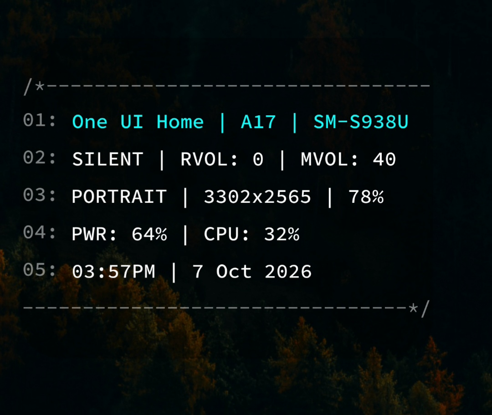
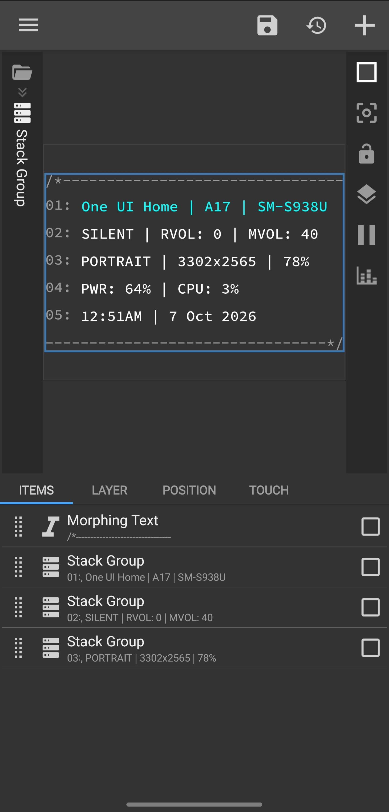

# TerminalHello Widget for KWGT

A terminal-themed Android system information widget made with **KWGT**.

TerminalHello pulls information directly from your Android device and displays it in a compact, terminal-style interface.

## Features

TerminalHello displays:

- **Launcher** / default launcher
- **Android version**
- **Device name**
- **Ringer mode**
  - Silent
  - Normal
  - Vibrate
- **Ringer volume**
- **Media volume**
- **Orientation**
  - Portrait
  - Landscape
- **Screen resolution**
- **Screen brightness**
- **Battery level**
- **CPU usage**
- **Current time**
- **Current date**

## Screenshots

## Requirements

- Android device
- [KWGT Kustom Widget Maker](https://play.google.com/store/apps/details?id=org.kustom.widget)
- A home screen launcher that supports widgets

## Installation

1. Download the `TerminalHello.kwgt` file from this repository.
2. Install **KWGT** if you don't already have it.
3. Add a **KWGT widget** to your Android home screen.
4. Resize the widget to your preferred size.
5. Tap the widget to open KWGT.
6. Use the **Import** option and select `TerminalHello.kwgt`.
7. Select **TerminalHello** from your imported presets.
8. Save the widget.

## Notes

TerminalHello is designed around the information and variables available through KWGT. Some values may vary depending on your Android version, device manufacturer, launcher, or the permissions available to KWGT (This widget does NOT need location permissions).

The widget is intended to be lightweight and primarily informational, with a terminal-inspired aesthetic.

## About

This is a personal project created with KWGT. Feel free to use it, modify it, or build on it however you want.
